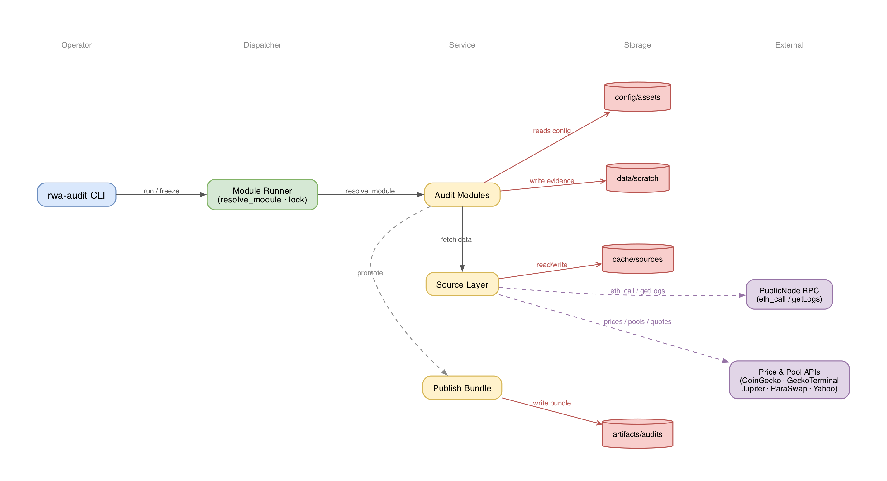

# rwa-audit

[](https://github.com/egpivo/rwa-audit/actions/workflows/ci.yml)
[](https://codecov.io/gh/egpivo/rwa-audit)

Rust tooling to collect and audit tokenized real-world asset (RWA) evidence. Pulls on-chain data, DEX pool snapshots, and exchange quotes; scores verifiable claims against stated surfaces; writes versioned publish bundles.



## Prerequisites

- Rust 1.78+ (`rustup update stable`)
- A public Ethereum RPC endpoint (default: `https://ethereum.publicnode.com`)
- Optional: CoinGecko, Ethplorer, GeckoTerminal, Jupiter API access (free tiers work)

## Installation

This tool is not published to crates.io — it must be run from the repository root because it reads config files at runtime (`config/sources.yaml`, `config/assets/*.yaml`).

```bash
git clone https://github.com/egpivo/rwa-audit
cd rwa-audit
cargo install --path crates/rwa-audit
```

After install, all binaries (`rwa-audit`, `rwa-freeze`, …) are available in `~/.cargo/bin/`. Run them from the repository root so the config paths resolve correctly.

## Usage

### Modules

| Module | What it does |
|--------|-------------|
| `article1` | On-chain contract registry + 30-day activity timeseries → promote publish bundle |
| `flow-panel` | DEX pool depth/volume panel (GeckoTerminal + Yahoo Finance) |
| `flow-quotes` | ParaSwap quote sweep across RWA tokens |
| `flow-tx` | Transaction reconstruction from tx hashes |
| `exchange` | xStocks exchange surface freeze → publish bundle |

### Run

```bash
# Article 1 — collect registry + activity, promote bundle
cargo run --bin rwa-audit -- run article1 --promote

# Article 2 — DEX panel, quotes, tx reconstruction
cargo run --bin rwa-audit -- run flow-panel
cargo run --bin rwa-audit -- run flow-quotes
cargo run --bin rwa-audit -- run flow-tx 0x<tx_hash>

# Article 3 — exchange surface (frozen publish)
cargo run --bin rwa-audit -- run exchange

# Article 3 — exchange surface (live probe only, no bundle update)
cargo run --bin rwa-audit -- run exchange --mode live
```

### Bundle management

```bash
cargo run --bin rwa-audit -- freeze list
cargo run --bin rwa-audit -- freeze promote article3-xstocks-2026-06-12
```

### Test & sync

```bash
cargo test
make sync
```

## Configuration

All API endpoints are declared in [`config/sources.yaml`](config/sources.yaml) — change `base_url` there to point at a different endpoint; no code change required.

Most sources need no credentials (CoinGecko, GeckoTerminal, ParaSwap, Jupiter, Yahoo Finance are keyless public APIs). The one optional env var:

```bash
export ETHPLORER_API_KEY=your_key   # defaults to "freekey" (rate-limited) when unset
```

Two CI-only env vars (not needed for local runs):

| Variable | Effect |
|----------|--------|
| `RWA_AUDIT_FROZEN_AT` | Pins the `frozen_at` timestamp written into manifests |
| `RWA_AUDIT_REPO_ROOT` | Overrides the repo root path (used in tests) |

To add a new data source, follow the 6-step guide in [docs/sources/README.md](docs/sources/README.md).

## Outputs

| Path | Contents |
|------|----------|
| `data/` | Article 1 live scratch (registry + activity CSVs) |
| `data/flow/` | Flow panel and quote snapshots |
| `data/exchange-live/` | Article 3 live probe staging (gitignored) |
| `artifacts/data/` | Frozen publish staging |
| `artifacts/audits/{id}/` | Versioned publish bundles |
| `cache/sources/` | API response cache |

## Docs

[docs/ARCHITECTURE.md](docs/ARCHITECTURE.md) · [docs/PUBLISH.md](docs/PUBLISH.md) · [docs/sources/README.md](docs/sources/README.md) · `config/assets/*.yaml`

## Posts

| # | Title | Scope |
|---|-------|-------|
| 1 | [If Everything Can Be Tokenized, What Should We Audit?](https://egpivo.github.io/2026/06/07/if-everything-can-be-tokenized-what-should-we-audit.html) | Contract registry + activity |
| 2 | [Where RWA Flow Leaves Traces](https://egpivo.github.io/2026/06/14/where-rwa-trades-and-exits-actually-clear.html) | Pools, quotes, tx recon |
| 3 | [Where RWA Exchange Risk Actually Sits](https://egpivo.github.io/2026/06/21/where-rwa-exchange-risk-actually-sits.html) | xStocks exchange surface |

MIT — [LICENSE](LICENSE).
