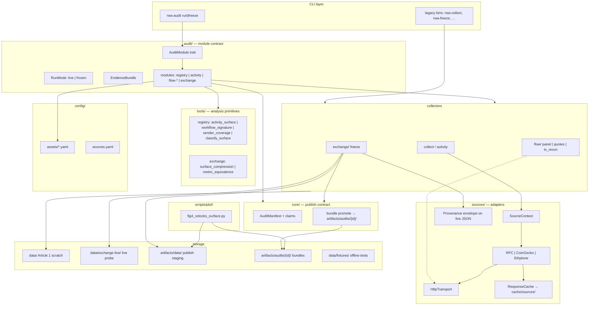
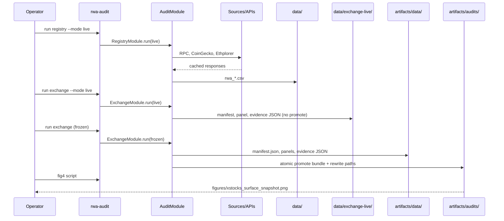

# Architecture

See diagrams below. Implementation lives in `crates/rwa-audit/src/`.

## Layer diagram



## Data flow (publish path)



## Module → method → sources

| CLI module | AuditMethod | RunMode default | Source adapters |
|------------|-------------|-----------------|-----------------|
| `registry` | Registry | live | publicnode_rpc, coingecko, ethplorer |
| `activity` | Activity | live | publicnode_rpc |
| `flow-panel` | FlowSurface | live | geckoterminal*, yahoo_finance* |
| `flow-quotes` | FlowSurface | live | paraswap* |
| `flow-tx` | FlowSurface | live | publicnode_rpc |
| `exchange` | ExchangeSurface | frozen (live → `data/exchange-live/`) | manual_import, geckoterminal*, jupiter* |

\* Flow Gecko/ParaSwap/Jupiter still in `flow/` — migration to `sources/` pending.

## Directory layout

```
config/assets/          # asset universe (YAML)
config/sources.yaml     # source registry
crates/rwa-audit/src/
  audit/                # Phase 4 unified CLI + AuditModule
  core/                 # manifest + bundle promote
  sources/              # Phase 3 adapters + cache
  evm.rs                # hex / log parsing
  collect.rs activity.rs flow/ exchange/
  tools/                # article 1 + 3 analysis primitives
data/                   # Article 1 live scratch (gitignored)
data/exchange-live/     # Article 3 live exchange probe (gitignored; not promoted)
data/flow/              # committed flow snapshots
data/fixtures/          # adapter test fixtures
artifacts/data/         # flat frozen evidence
artifacts/audits/       # versioned publish bundles
cache/sources/          # API response cache (gitignored)
scripts/plot/           # figure generators
```
